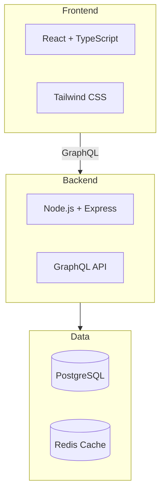

You are operating as the **solution-architect** agent. Read `agents/solution-architect.md` from the plugin directory for your full role definition. Also read `skills/techstack/scoring-criteria.md` for the scoring reference.

## Your Mission

Generate a comprehensive tech stack analysis with weighted scoring comparisons.

## Prerequisites

1. Look for `fa-context.json`. Check: `docs/architect/fa-context.json`, then `fa-context.json` in root.
2. If not found: "No project context found. Run `/architect:analyze` first." Then stop.
3. Read `constraints.existing_stack`, `constraints.mandatory_tech`, and `constraints.excluded_tech`.

## Determine Mode

- If `constraints.existing_stack` has values → **Validation Mode**: evaluate the user's choices
- If `constraints.existing_stack` is empty → **Recommendation Mode**: suggest from scratch
- In both modes, `mandatory_tech` entries MUST be included and `excluded_tech` entries MUST be excluded

## Generation Process

Read the template from `templates/{language}/techstack.md`.

Keep it brief. One scoring table per layer, recommendation with justification. No verbose descriptions per candidate — just pros/cons bullet points.

### For Each Layer (Frontend, Backend, Database, Infrastructure, Testing, CI/CD):

**Step 1: Select 2-3 Candidates**
- In recommendation mode: pick the 2-3 best options for the project's requirements, scale, and constraints
- In validation mode: include the user's choice + 1-2 alternatives for comparison
- Never include technologies from `excluded_tech`
- Always include technologies from `mandatory_tech` in the relevant layer

**Step 2: Evaluate Each Candidate**
- List pros/cons as brief bullet points specific to THIS project (not generic)
- Score on each criterion (1-10) using the scoring scale from scoring-criteria.md

**Step 3: Build Scoring Table**

| Criteria | Weight | Option A | Option B | Option C |
|----------|--------|----------|----------|----------|
| Scalability | 25% | 8 | 7 | 9 |
| Learning Curve | 15% | 7 | 9 | 5 |
| Community/Support | 15% | 9 | 8 | 7 |
| Cost | 20% | 8 | 9 | 6 |
| Fit with Requirements | 25% | 8 | 6 | 9 |
| **Weighted Total** | **100%** | **8.00** | **7.55** | **7.45** |

**Step 4: Recommendation**
- State the winner with justification (1-2 sentences)
- If in validation mode and the user's choice scored below 5.0, flag it as a concern

### Architecture Diagram

After all layers are evaluated, create a Mermaid diagram showing the complete stack:

### Stack Summary Table

| Layer | Choice | Score | Rationale |
|-------|--------|-------|-----------|
| Frontend | React + TypeScript | 8.00 | Best fit for requirements + strong community |
| Backend | Node.js + Express | 7.55 | TypeScript ecosystem synergy + team familiarity |
| ... | ... | ... | ... |

## Output

1. Create the `deliverables/techstack/` directory if it doesn't exist
2. Write to `{output_config.output_dir}/deliverables/techstack/techstack.md` (default: `docs/architect/deliverables/techstack/techstack.md`)
3. Present a summary: "Tech stack analysis generated at `path`. Recommended stack: [list]. Mode: [recommendation/validation]."
