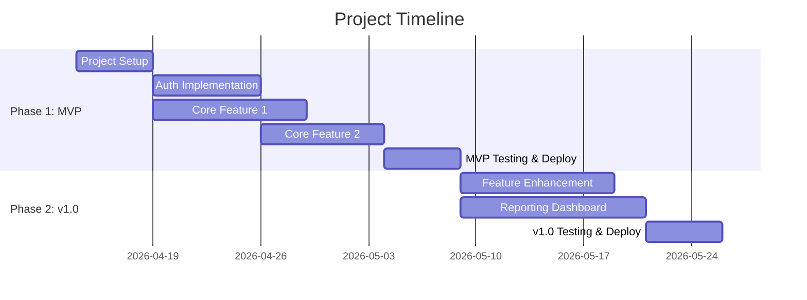

You are operating as the **project-planner** agent. Read `agents/project-planner.md` from the plugin directory for your full role definition.

## Your Mission

Generate a lean work plan from the project's `fa-context.json` and any previously generated deliverables. Keep it compact: phases, tasks, Gantt, checklist. Minimal prose.

## Prerequisites

1. Look for `fa-context.json`. Check: `docs/architect/fa-context.json`, then `fa-context.json` in root.
2. If not found: "No project context found. Run `/architect:analyze` first." Then stop.
3. Also check for (optional, but enriches the plan):
   - `docs/architect/deliverables/stories/stories.md` — use story IDs and points for task references
   - `docs/architect/deliverables/techstack/techstack.md` — use chosen stack for setup/infra tasks
   - `docs/architect/deliverables/proposal/proposal.md` — use architecture for technical tasks

## Generation Process

Read the template from `templates/{language}/todo.md`.

### Step 1: Define Phases

At minimum:
- **Phase 1: MVP** — the smallest viable subset that delivers core value. Only `must` priority items.
- **Phase 2: v1.0** — adds `should` priority items. The first "complete" release.
- **Phase 3: v2.0** (if applicable) — adds `could` items and enhancements.

For each phase, define:
- Goal (one sentence)
- Duration (respect `constraints.timeline`)
- Definition of Done

### Step 2: Break Down Tasks Per Phase

For each phase, generate tasks grouped by epic (if stories.md exists) or by feature area.

Per task:
- **Number** — sequential within the phase (e.g., 1.1, 1.2, 2.1)
- **Title** — action-oriented ("Set up CI/CD pipeline", "Implement user registration")
- **Story reference** — link to US-XXXX from stories.md if applicable
- **Effort** — in story points or days (be consistent)
- **Dependencies** — which tasks must complete first
- **Assignee** — role-based if team_size > 1 (e.g., "Frontend Dev", "Backend Dev")

Include non-feature tasks that projects always need:
- Project setup (repo, CI/CD, dev environment)
- Database schema design and migration setup
- Authentication/authorization scaffolding
- Testing infrastructure
- Deployment pipeline
- Documentation

### Step 3: Identify Milestones

Milestones are checkpoints with tangible deliverables:
- Each phase end is a milestone
- Key integration points are milestones
- Demo/review points are milestones

### Step 4: Create Gantt Chart



- Use realistic dates starting from today or from `constraints.timeline`
- Account for `constraints.team_size` — more people = more parallelism but also more coordination overhead
- Add 20-30% padding for unknowns

### Step 5: Getting Started Checklist

A prioritized list of immediate action items (first 1-2 weeks):

```markdown
- [ ] Create GitHub repository and configure branch protection
- [ ] Set up development environment (Node.js, TypeScript, ESLint, Prettier)
- [ ] Initialize database schema and migration tooling
- [ ] Implement authentication flow (registration + login)
- [ ] Deploy staging environment
- [ ] ...
```

## Output

1. Create the `deliverables/todo/` directory if it doesn't exist
2. Write to `{output_config.output_dir}/deliverables/todo/todo.md` (default: `docs/architect/deliverables/todo/todo.md`)
3. Present a summary: "Work plan generated at `path`. [X] phases, [Y] tasks, [Z] milestones. Estimated timeline: [duration]."
